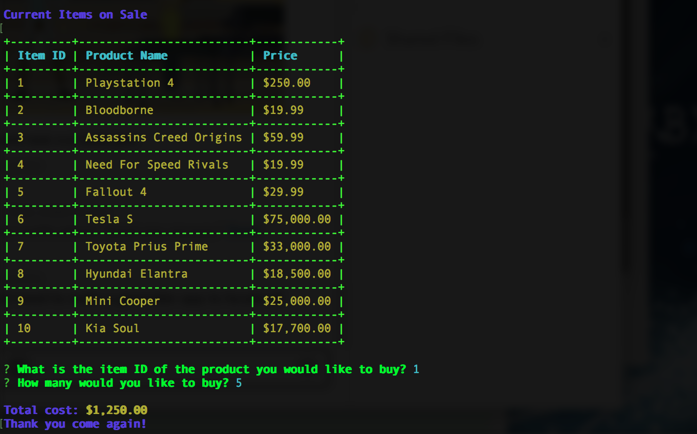
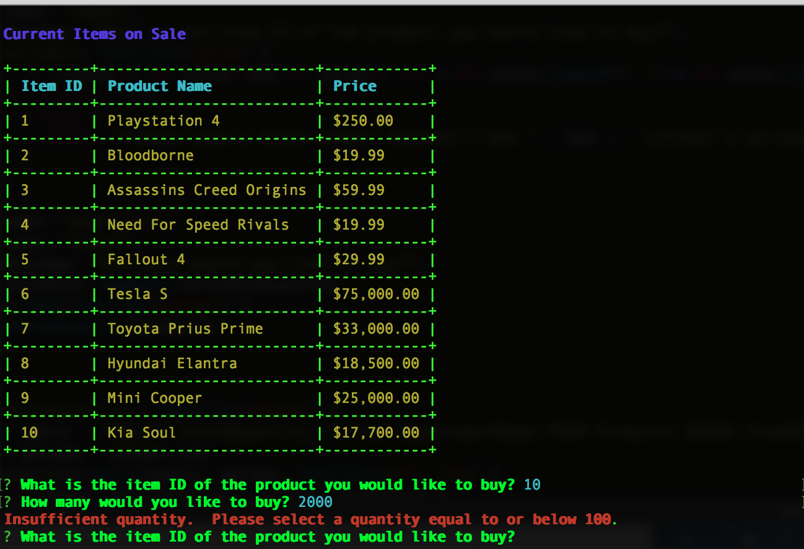
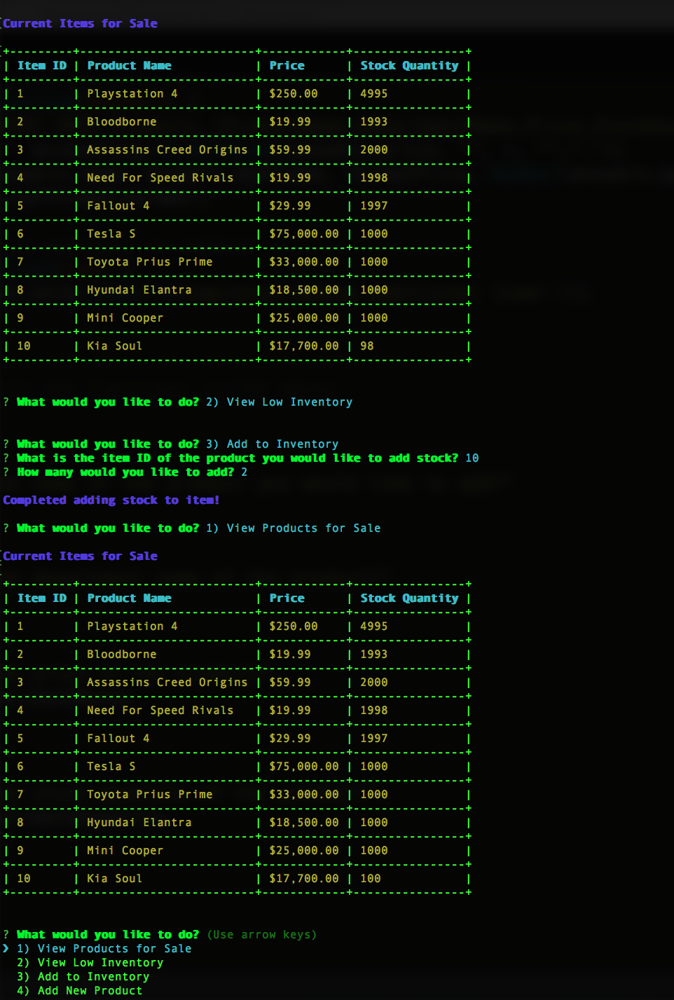
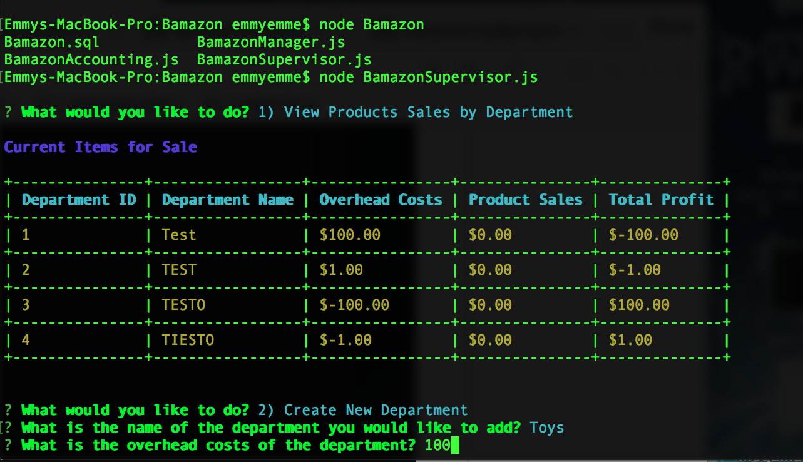

# Bamazon

Amazon-like store application utilizing a Unix Command Line Interface, Node.js, NPM drivers to control an Express Server, MySql Database, Accounting, and an Inquirer Prompt. 

This App allows customers, as well as managers and executives, to access product data, make purchases, check stock, and alter inventory.

The following features are included. 

I. CUSTOMER VIEW

On runtime initialization of the module, 'bamazonCustomer.js', the Item ID, product name, and price of each product are displayed to the user. The user is prompted to enter the item ID of the product they would like to buy as well as how many units they would like to buy. 

Once the user has placed the order, Bamazon checks if the store has enough of the product to meet the customer's request. If so, the Item's Price and Stock Quantity are updated accordingly. If not, the app logs the phrase, "Insufficient quantity!", and prevents the order from going through.

The Item ID, Department Name, Price, and Stock Quantity are maintained in Bamazon's database. The Bamazon database will be updated after purchases are completed. 

II. MANAGER VIEW 

On runtime initialization of the module, BamazonManager.js, the Manager has the ability to select between the following options to alter the inventory:

* View Products for Sale
* View Low Inventory
* Add to Inventory
* Add New Products

 

III. SUPERVISOR VIEW 

On runtime initialization of the module, BamazonSupervisor.js, the Supervisor has the ability to select between the following options: 

* View Product Sales by Department 
* Create New Department 

When a supervisor selects View Product Sales by Department, Bamazon displays a summarized table in the console. 
The Total Profit column is calculated on the fly using the difference between Overhead Costs and Product Sales. Since Total Profit is a variable cost, subject to change at any instance, it is the only data set that is not permanently stored in any database. 

